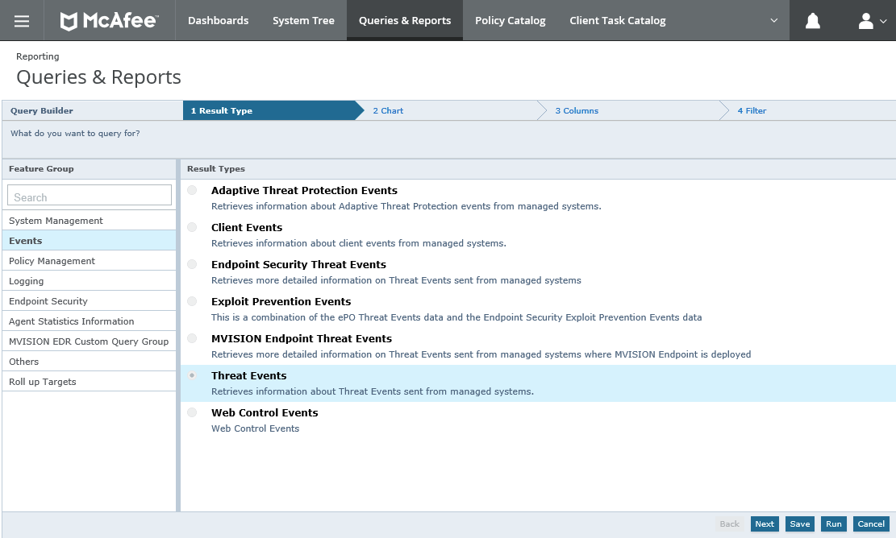
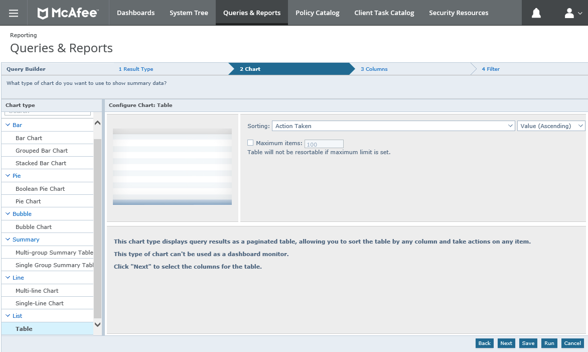
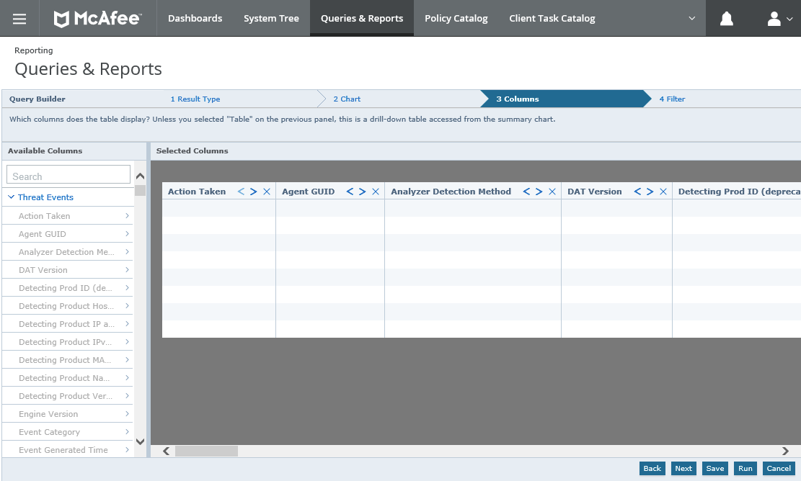
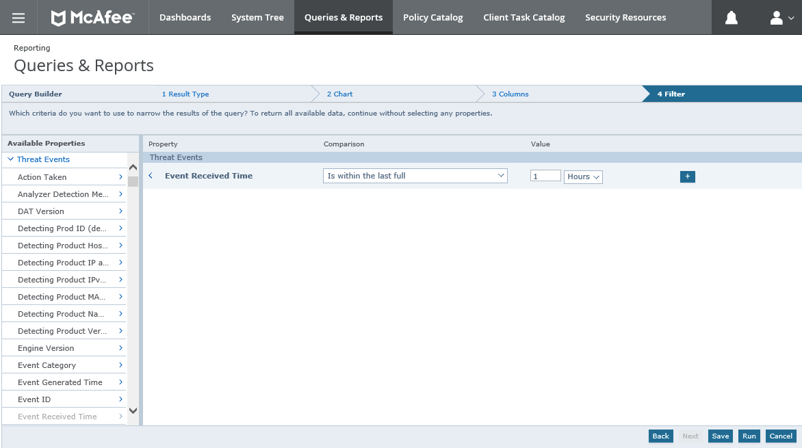
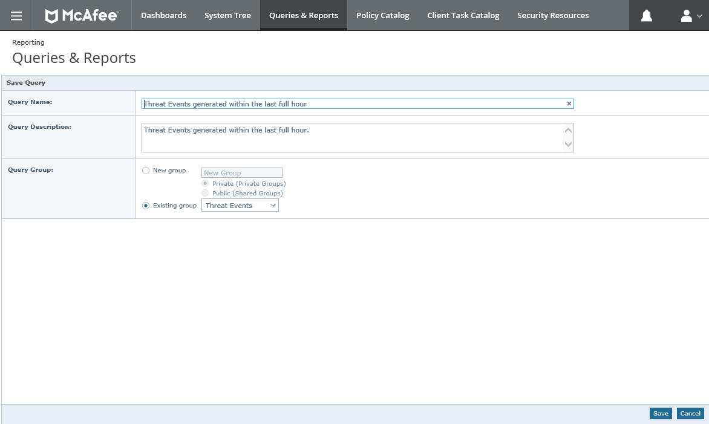
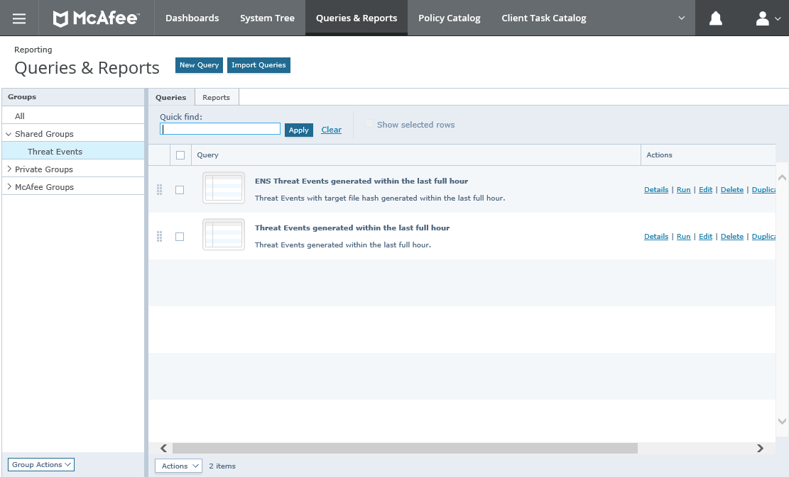
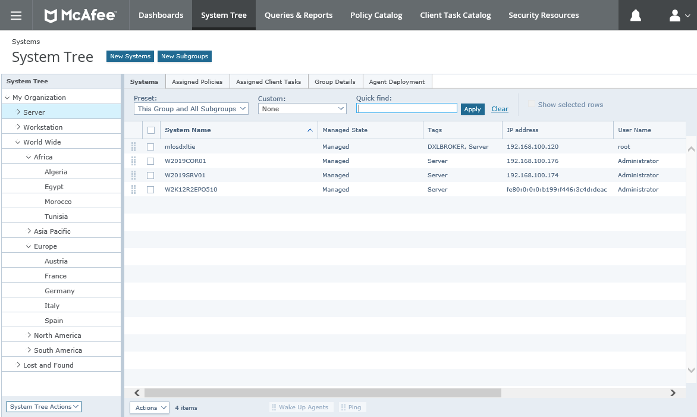

# Multi-SIEM-Support-For-McAfee-ePO
 Multi SIEM support for McAfee ePolicy Orchestrator

## Purpose of this project
The purpose of this project is to propose a solution for enterprises that use a unique centrale ePO server to manage all endpoints across the entire Group/Enterprise including subsidiaries and are looking to offer a point of data collection for subsidiaries SIEM/SOC. While most of SIEMs are establishing a direct connection to ePO or its database or while ePO can redirect all events to a Syslog receiver, it forces each subsidiary to get a view/access to logs from all subsidiaries. 
I'm proposing a "Pull Request" approach through ePO WebAPI based on ePO User Account to filter/limit log access to only the scope that each subsidiary is participating/acting to.

TO DO: Include a graphic to illustrate the current concept

## Designing the Threat Event query
As a standard approach, you can decide to start with all the columns available from the Threat Events table of the ePO database. It will be the best point to start as most SIEM are simply grabbing events from this table. Also, this is what McAfee decided to offer for his "Pull Events" API from the SaaS version of ePolicy Orchestrator, aka MVISION ePO. (Please read the following [documentation page](https://docs.mcafee.com/bundle/mvision-epolicy-orchestrator-product-guide/page/GUID-26C1A6F2-DEB6-48B6-80D6-509649C356BC.html) for more information about this service.)

If you don't want to import my query ("query-threat-events.xml"), you can build your own. From ePO console menu -> Queries & Reports, click "New Query".

Select "Threat Events" as the source for the query, then click "Next".

Choose the table "Chart Type", then click "Next".

Then add all columns available from Threat Events. I like to add also the Assignement Path in this query because based on the ePO System Tree, the location of the system within the tree could definitely helps to understand the event or identify the targeted system. 
Here is the list of all columns used in my query:

| ----------------------- | ----------------- | ----------------- |
| ThreatActionTaken       | DetectedUTC       | SourceURL         |
| AgentGUID               | ThreatEventID     | SourceUserName    |
| AnalyzerDetectionMethod | ReceivedUTC       | TargetFileName    |
| AnalyzerDATVersion      | EventTimeLocal    | TargetHostName    |
| Analyzer                | ServerID          | TargetIPV6        |
| AnalyzerHostName        | ThreatHandled     | TargetIPV4        |
| AnalyzerIPV6            | ThreatName        | TargetMAC         |
| AnalyzerIPV4            | ThreatSeverity    | TargetProtocol    |
| AnalyzerMAC             | SourceHostName    | TargetPort        |
| AnalyzerName            | SourceIPV6        | TargetProcessName |
| AnalyzerVersion         | SourceIPV4        | TargetUserName    |
| AnalyzerEngineVersion   | SourceMAC         | ThreatType        |
| ThreatCategory          | SourceProcessName | AssignementPath*  |

*Note:* Assignement Path is coded as "EPOBranchNode.NodeTextPath2".

As the goal is to run the pull events request every hour, here I'm filtering the events based on the last full received hour. (I'm not using the Event Generated Time because the agent may not present today and will report their events the day after, so if you don't want to miss events, you need to work based on the Event Received Time.) 
You can adapt the filter based on your needs (i.e: last 5 minutes or last day.) Then click "Next".

Enter the name and description you want for this query and click "Save".

I also built another query where I  added the "Targeted File Hash' reported in the case of the ENS detection. Feel free to add any columns that could add value to your SIEM based on your needs. Then I decided to save those queries in a "Shared Group" that I plan to use in a dedicated Permission Set.

## Provisionning Accounts and Permission Sets
Permission Set will allow ePO Administrator to set a hard-coded filter on the execution of the query by each subsidiary.

Define a new ePO user and permission set per subsidiary with the following permissions:
- **Queries and Reports:** Use public groups, and these shared groups: Threat Events.
- **Systems:** View "System Tree" tab 
- **System Tree access:**  Can search on the following nodes and parts of the System Tree:*The-subsidary-folder*
- **Threat Event Log:** View events 
 
 TO DO: Add an ePO example of Permission Set with the indicated permissions as an illustration.  

**Note:** The on-demand creation or the provisioning of all users and permission sets can be done through the WebAPI also. (That script is not part of the current project).

## Pull Request the Threat Events though the API
Use the script to pull event every hours. 
Here the script is saving "pulled events" in a simple file. You can adapt that script the save event in a syslog stream instead and configure the syslogd to forward those events to a syslog receiver from your SIEM.

 TO DO: Add a json sample file with pulle devents.